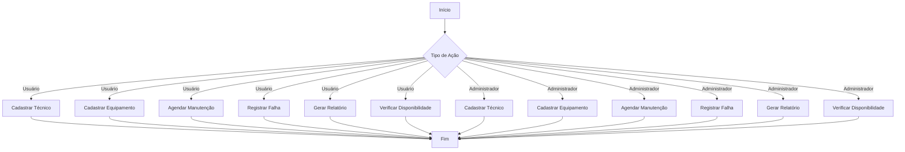
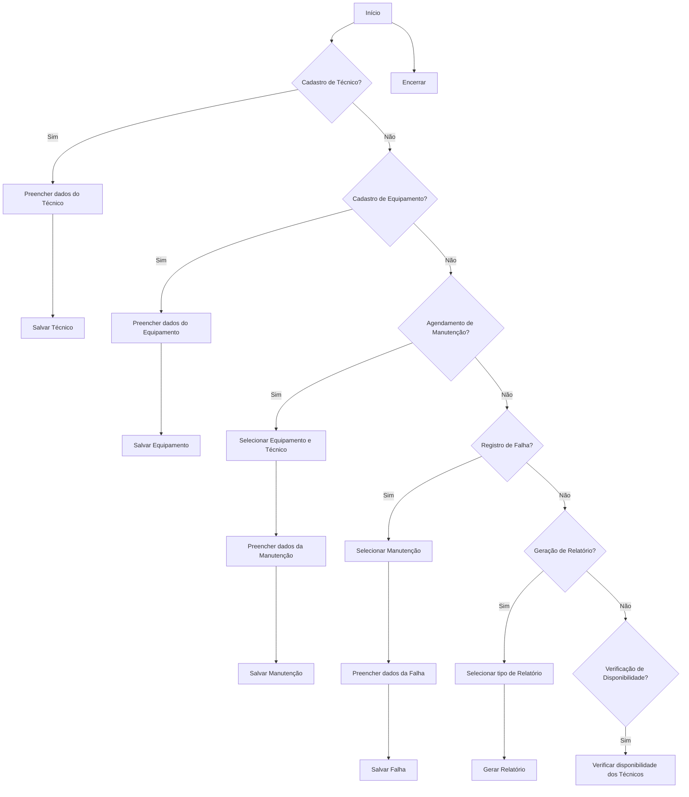

# Sistema de Manutenção Preventiva e Corretiva

## Descrição do Projeto

Este projeto é um sistema de gerenciamento de manutenção preventiva e corretiva para máquinas e equipamentos industriais. O sistema permite controlar manutenções preventivas, registrar falhas, gerenciar a alocação de técnicos e gerar relatórios detalhados sobre o histórico de manutenção e desempenho dos equipamentos.

## Tecnologias Utilizadas

- Java
- PostgreSQL, MongoDB, ou Json-Server para persistência de dados
- Swing ou JavaFX para interfaces gráficas
- JUnit para testes unitários

## Funcionalidades

- Cadastro de técnicos, equipamentos e manutenções
- Agendamento de manutenções preventivas e corretivas
- Registro de falhas e peças substituídas
- Gerenciamento da alocação de técnicos
- Geração de relatórios de manutenção
- Verificação de disponibilidade de técnicos

## Diagramas

### Diagrama de Classes

1. Classe

```mermaid
    class Tecnico {
        +int id
        +string nome
        +string especialidade
        +boolean disponivel
        +getId()
        +setId(int)
        +getNome()
        +setNome(string)
        +getEspecialidade()
        +setEspecialidade(string)
        +isDisponivel()
        +setDisponivel(boolean)
    }

    class Equipamento {
        +int id
        +string aparelho
        +string modelo
        +string local
        +getId()
        +setId(int)
        +getAparelho()
        +setAparelho(string)
        +getModelo()
        +setModelo(string)
        +getLocal()
        +setLocal(string)
    }

    class Manutencao {
        +int id
        +int idEquipamento
        +int idTecnico
        +string tipo
        +string descricao
        +LocalDate data
        +string status
        +string pecasSubstituidas
        +int tempoInatividade
        +getId()
        +setId(int)
        +getIdEquipamento()
        +setIdEquipamento(int)
        +getIdTecnico()
        +setIdTecnico(int)
        +getTipo()
        +setTipo(string)
        +getDescricao()
        +setDescricao(string)
        +getData()
        +setData(LocalDate)
        +getStatus()
        +setStatus(string)
        +getPecasSubstituidas()
        +setPecasSubstituidas(string)
        +getTempoInatividade()
        +setTempoInatividade(int)
    }

    Tecnico "1" -- "0..*" Manutencao : realiza >
    Equipamento "1" -- "0..*" Manutencao : passa por >
```

  2. Uso


 3. Fluxo

